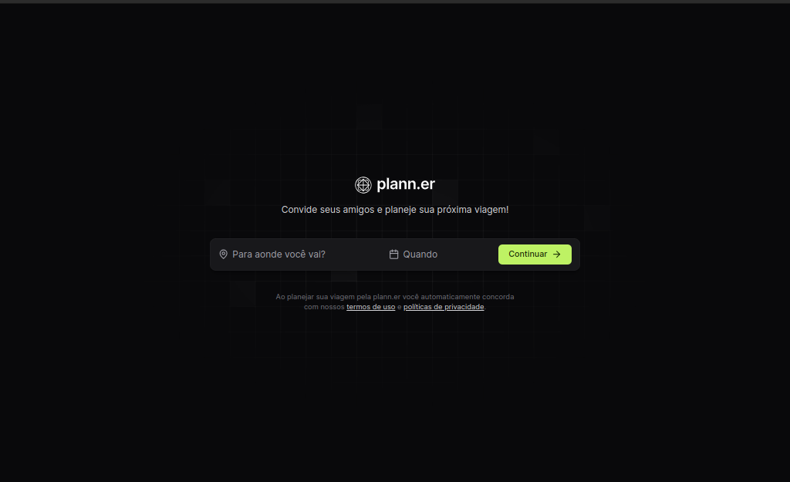
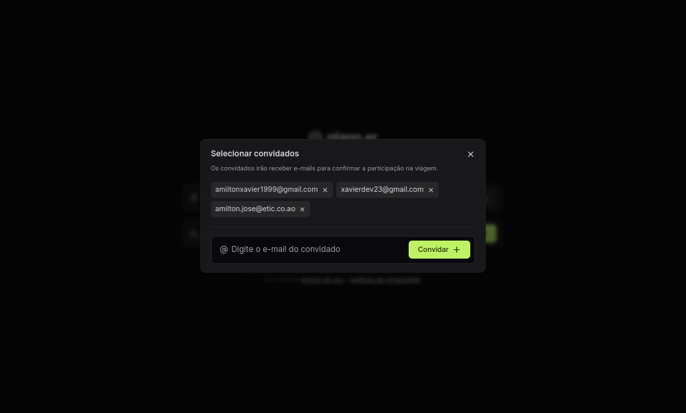
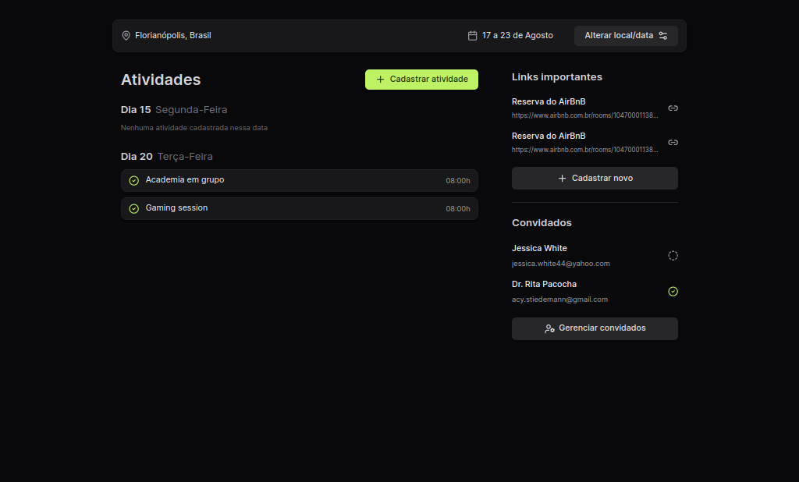

# Plann.er

Um aplicação web para criar planos de viagem para trabalho ou férias com amigos, registrando atividades, adicionando links importantes e convidando novos participantes. Este projeto foi desenvolvido durante o evento NLW da Rocketseat na trilha de React.

## Captura de tela

 - Cria de uma viagem 

 - Adicionar convidado

 - Detalhes da Viagem 


## Funcionalidades
- **Criação de Planos de Viagem:**
  - Adicione datas, títulos e descrições para suas viagens.

- **Registro de Atividades:**
  - Programe atividades diárias, incluindo descrições, horários e locais.

- **Adição de Links Importantes:**
  - Armazene links relevantes como reservas de hotéis, passagens de avião, mapas, etc.

- **Convite de Participantes:**
  - Convide amigos ou colegas para colaborar no planejamento da viagem.

## Tecnologias Utilizadas

- [React](https://reactjs.org/)
- [React Router](https://reactrouter.com/)
- [Axios](https://axios-http.com/)
- [Vite](https://vitejs.dev/)
- [Tailwind](https://tailwindcss.com/)
- [DayPicker](https://daypicker.dev/)
- [TypeScript](https://www.typescriptlang.org/)

## Requisitos

- Node.js >= 14.x
- npm >= 6.x ou yarn >= 1.22.x

## Instalação

Clone o repositório:

```bash
git clone https://github.com/Amiltonxavier/plann.er.git
cd plann.er
npm install
# ou
yarn install
```
## Uso

Para iniciar o servidor de desenvolvimento:

```
npm start
# ou
yarn start
```

Abra ```http://localhost:5173``` para ver o projeto no seu navegador.

## Contribuição
Se você quiser contribuir com o projeto, siga estas etapas:

 - Fork o repositório
 - Crie uma branch para sua feature (git checkout -b feature/nome-da-feature)
 - Commit suas mudanças (git commit -am 'Adiciona uma nova feature')
 - Faça push para a branch (git push origin feature/nome-da-feature)
 - Crie um novo Pull Request

## Licença

Este projeto está licenciado sob a Nome da Licença.

Contato
Amilton Xavier - @Amiltonxavier - amilltonxavier1999@gmail.com

Link do Projeto: https://github.com/Amiltonxavier/plann.er.git

```Você pode personalizar esse template conforme as necessidades do seu projeto.```